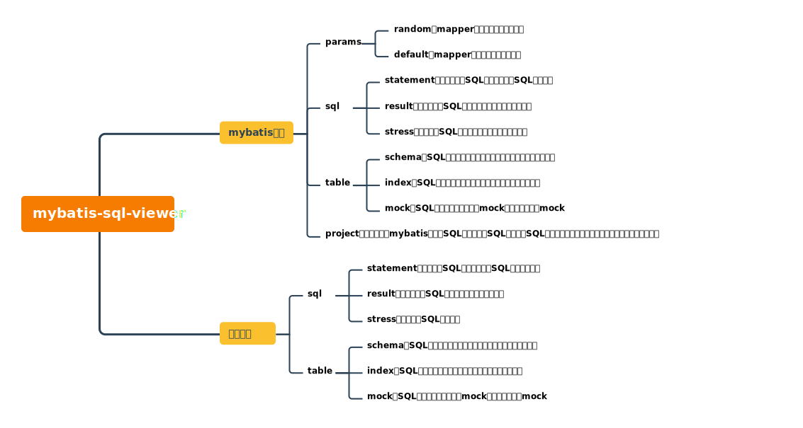
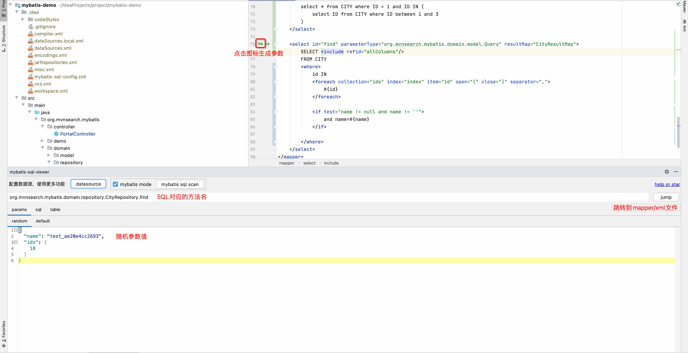
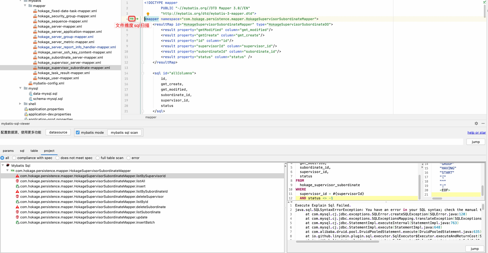

[](https://plugins.jetbrains.com/plugin/18713-mybatis-sql-viewer)
[](https://plugins.jetbrains.com/plugin/18713-mybatis-sql-viewer)
[](https://sonarcloud.io/project/overview?id=linyimin-bupt_mybatis-sql-viewer)

[中文](README.md) |
[ENGLISH](README_EN.md)

# 简介

虽然写了很久的CRUD，但是依旧觉得写好CRUD是一件非常难且麻烦的事情，以下的情况在开发过程中应该都遇到过：

- SQL测试好麻烦，写错了SQL字段或者表名称，修改完要重启(几分钟过去了)
- 造数据好麻烦，特别是还存在表关联的情况，数据内容不真实，还容易超出字段长度，让人抓狂
- SQL好不容易能跑了，又会有以下的疑问
  - 符不符合SQL开发规范？
  - 是否能命中索引？
  - 性能怎么样，是否会存在慢SQL？
  - 日常环境数据太少，如何模拟SQL在线上运行的真实情况？

对于使用Mybatis的开发者还会存在这些问题：

- Mapper接口方法和XML标签不对应，修改完要重启(又几分钟过去了)
- XML中多写了一个`,`，又没有错误提示，接口测试调用时才发现，修改完又又要重启(好多个几分钟过去了)
- 这个Mapper接口对应的是哪个XML文件？找找十几秒过去了
- 这个XMl文件对应的是哪个Mapper接口？找找十几秒又过去了
- 这个项目中有多少个XML文件？里面是否存在慢SQL？是否都符合开发规范？


按照这种开发模式，需要重启好多次应用，对于每次启动都需要几分钟应用来说开发体验简直就是灾难。基于上述的问题，开发了mybatis-sql-viewer插件，基于此插件可以实现以下能力而不需要启动应用：



基于此插件可以提高CRUD的效率及SQL质量，开发流程可以转换为如下模式：


上述的规约均来自《阿里巴巴Java开发手册》中的MySQL数据库章节。

# 安装

`IntelliJ IDEA` > `Preferences` > `Plugins` > `Marketplace` > `Search for "mybatis sql viewer"` > `Install Plugin` > `Restart IntelliJ IDEA`

# 使用

此插件有两种模式：mybatis模式和非mybatis模式。差别在于mybatis模式支持以下功能：

- mapper接口方法参数mock
  - 随机参数
  - 默认参数
  - 自定义参数
- mapper接口/方法跳转XML文件
- XML文件跳转mapper接口/方法
- 基于mock参数将mapper接口方法的xml转换成真实SQL
- 按照文件/项目维度扫描XML文件，并生成对应的真实SQL语句，并进行规约/索引相关校验

因为需要拉取数据库表的元数据信息、执行SQL，所以使用前需要配置一下数据源。支持多数据源配置，点击「datasource」按钮即可完成数据源的创建、选择、删除、测试。


## 非mybatis模式

将`mybatis mode`的勾选框关闭即可使用`非mybatis模式`，然后在「statement」Tab左栏手写SQL即可。


## mybatis模式

将`mybatis mode`的勾选框选中即可使用`mybatis模式`，`mybatis模式`主要添加了mapper接口方法参数mock、文件跳转及mybatis文件扫描的功能。

在mapper接口或XML文件中点击「sql」图标，即可生成mapper方法参数随机值，如果对生成的随机不满意或不满足条件，可以手动修改进行自定义。然后点击「statement」Tab即可使用该参数将mybatis的xml实现转换成真实的SQL语句。



### mybatis sql扫描

支持文件和项目两个维度扫描。

1. 文件维度扫描

点击`<mapper namespace="xxx.xxx.xxx">`或者`namespace`对应的mapper接口旁边的「sql」图标即可完成文件维度mybatis sql的扫描



2. 项目维度

点击「mybatis sql scan」即可进行项目维度mybatis sql的扫描


扫描结果左侧是mybatis文件的namespace（对于mapper接口名）及其下的方法名，点击具体的方法，右侧产生其对应的SQL语句，并会对该SQL语句进行规约检查、索引检查并输出此SQL语句的的执行计划

**图标说明**

：表示SQL规约检查和索引检查均符合要求的SQL语句

：表示SQL规约检查不符合要求的SQL语句

：表示索引检查不符合要求的SQL语句，可能存在全表扫描(含索引的全表扫描)

：表示生成的SQL语句存在问题：可能是SQL编写错误，参数错误，数据库连接错误等

**可通过单选框选择对应的条件进行过滤**

- all：所有语句
- compliance with spec：符合SQL规约要求的SQL语句
- does not meet spec：不符合SQL规约的要求的SQL语句
- full table scan：存在全表扫描的SQL语句
- error：存在错误的SQL语句，可能是SQL编写错误，参数错误，数据库连接错误等


## 「sql」Tab

### 1. 「statement」Tab

对于「非mybatis模式」需要左栏编写SQL语句，「mybatis」模式则需要在mapper接口或XML文件中点击「sql」图标生成SQL，右栏自动进行语法校验和规规约校验

1. SQL语法校验


2. 规约校验


### 2. 「result」Tab

点击「result」tab后会自动执行「statement」Tab中的SQL语句。执行结果由3部分组成：执行信息、执行计划及执行结果。

1. 执行信息包含：执行的语句、执行该条语句的耗时、返回的记录数及表中记录总数
2. 执行计划：EXPLAIN对应的结果
3. 执行结果：结果表格，默认只返回100条记录（只有SELECT语句有该信息）


### 3. 「stress」Tab

点击「stress」Tab进行压测配置，配置页面如下：


**配置说明**

1. 值类型由两种方式组成：
   1. `use sql directly`：表示直接使用「statement」Tab中的SQL语句进行压测
   2. `configure parameters`：表示对「statement」Tab中的SQL语句的条件进行参数配置。
2. 流量模型也是由两种方式组成（与并发数有关）：
   1. `increase in a constant rate`：并发数按照固定速率增长，增长速率由「递增时长」指定
   2. `fixed concurrent number`：直接按照指定并发数进行压测
3. 递增时长：指定并发数的增长速率，单位为秒
4. 并发数：同时执行SQL语句的线程数
5. 压测时长：指定压测时间，单位为分钟，**因为压测的指标数据直接存在内存中，应该避免压测时间过长造成Idea OOM**

配置完成后，点击「stress」按钮即可进行压测，并自动跳转到压测报告「report」Tab

**压测报告**

压测报告中主要包含指标：

- 请求成功率
- TP99
- TP90
- 最大RT
- 平均RT
- 最大TPS
- 平均TPS
- 并发数
- 异常数
- 总请求数

图表包含：
- 请求成功率
- 平均RT
- TPS


## 「table」Tab

点击「table」Tab时会对「statement」Tab中的SQL语句进行解析，提取出表名称，然后每个表作为一个Tab。如以下语句：

```mysql
SELECT
    state
FROM
    CITY
WHERE
    country_name IN (
        SELECT
            name
        FROM
            COUNTRY
        WHERE
            id IN (1, 2, 3)
    )
```

SQL语句中包含了两个表：`CITY`和`COUNTRY`，所以会产生两个Tab，如下图所示：


### 1. 「schema」Tab

1. 左栏显示表的字段信息：字段名称、类型、是否可为NULL、默认值、索引、注释说明等信息
2. 右栏显示对表进行建表规约检查的结果：如表名、字段名是否包含大写字母或特殊字符等检查


### 2. 「index」Tab

1. 左栏显示表的索引信息
2. 右栏显示对索引进行规约检查的结果


### 3. 「mock」Tab

mock表数据，支持批量数据mock，左栏进行mock数据类型配置，右栏显示mock结果

**mock规则**

左栏表单中「Mock Type」和「Mock Value」进行mock配置。初始化时，已经按照字段类型设置了默认的配置，可以按照需求进行修改。支持多种mock数据规则：

- random：随机值
  - string
  - name：姓名
  - datetime：形如：2023-01-01 00:00:00
  - integer
  - decimal
  - date：形如2023-01-01
  - timestamp
  - time：形如18:00:00
  - year：形如2023
  - city
  - url
  - email
  - ip
  - university
  - phone
- lexicon：自定义词库
- database：数据库，需要填写`table.field`
- increment：递增
- fixed：固定值
- regex：正则
- none：不进行mock，生成insert语句时包含此字段


**词库创建**

点击「lexicon」按钮，即可进行词库的创建


**mock数据预览**

配置好mock配置后，可以点击「preview」按钮进行mock数据的预览，默认会生成50条数据


**mock数据**

预览数据符合要求后，点击「mock」按钮完成数据的插入，默认插入100条数据，通过修改「Mock Rows」的值指定mock记录数，经测试，插入10w条数据花费时间在10秒内，所以可以进行大批量数据mock。


**mock数据清理**

mock数据完成后，会存储主键id的范围（持久化存储到本地文件），在对SQL语句进行压测完成后，可以进行清理，避免污染日常真实的测试数据。点击「Clean」按钮即可完成清理工作


